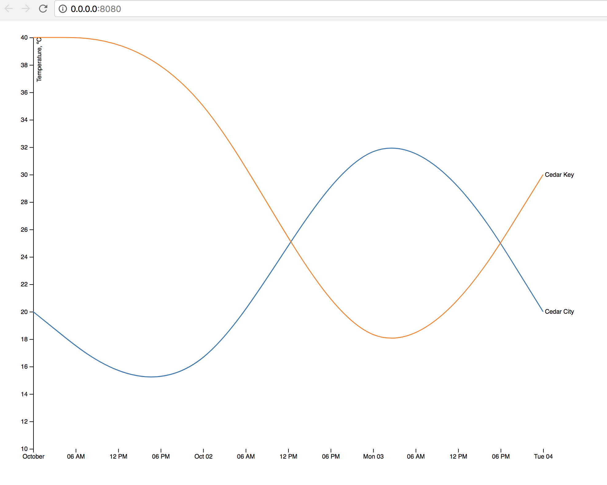

# webpack-d3

## Quick start
```bash
npm install
```

### Development
```bash
npm start
```

### "Production"
```bash
npm run build
```

## Preview


## Based on
https://bl.ocks.org/mbostock/3884955

## Note to self

### webpack3-tree-shaking

#### Research
- https://stackoverflow.com/questions/42143240/webpack-2-not-tree-shaking-d3-js-properly
- https://advancedweb.hu/2017/02/07/treeshaking/
- https://github.com/indutny/webpack-common-shake
- https://github.com/c3js/c3/issues/1417#issuecomment-311716054

#### Source
https://survivejs.com/webpack
